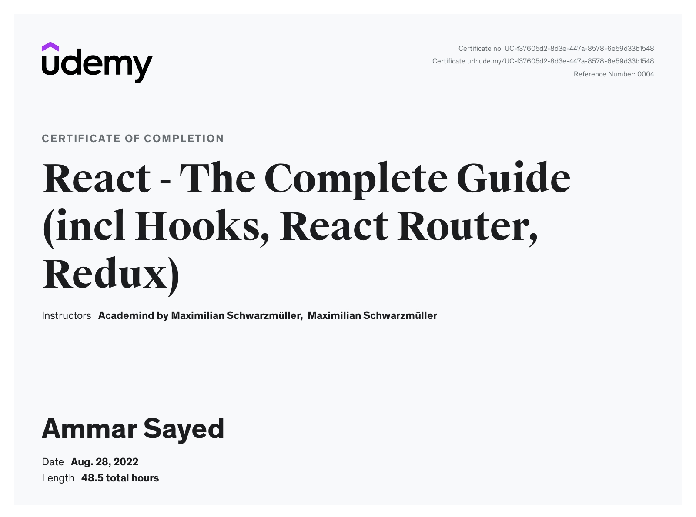

# React The Complete Guide (incl Hooks, React Router, Redux)

Dive in and learn React.js from scratch! Learn Reactjs, Hooks, Redux, React Routing, Animations, Next.js and way more!

## How to use

The code snapshots are organized in multiple **branches** where every branch **represents a course section**.

You can switch branches via the branch dropdown above the directory explorer.

## Certificate

